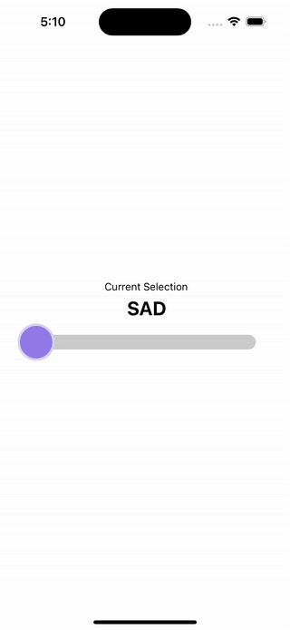

# react-native-vater-slider

A fully customizable **selector component** for React Native, built from scratch.

⚡ **Ultra-smooth 60 FPS animations** for a seamless experience.  
🎨 Supports **custom thumbs** or a default option.  
🤌 Designed for **intuitive gestures & interactions**.

## 💡 Features

✅ High-performance animations (60 FPS)  
✅ Fully customizable thumb styles  
✅ Smooth, gesture-based selection  
✅ Lightweight & easy to integrate  
✅ Haptic feedback support

## 📽️ Demo



## 📦 Installation

Install using npm:

```sh
npm install react-native-vater-slider
```

Or using Yarn:

```sh
yarn add react-native-vater-slider
```

Additionally, install the required dependencies:

```sh
npm install react-native-reanimated react-native-gesture-handler react-native-haptic-feedback
```

Or using Yarn:

```sh
yarn add react-native-reanimated react-native-gesture-handler react-native-haptic-feedback
```

## 🚀 Usage

```javascript
import Slider from 'react-native-vater-slider';

const sliderValues = [
  { value: 1, tintColor: '#785AE6' },
  { value: 2, tintColor: '#D06B35' },
  { value: 3, tintColor: '#AC826B' },
  { value: 4, tintColor: '#F4C21F' },
  { value: 5, tintColor: '#7E9A2A' },
];

function App() {
  return <Slider values={sliderValues} />;
}
```

## 🔧 Props

| Prop                   | Type                                        | Description                                                                                                                 |
| :--------------------- | :------------------------------------------ | :-------------------------------------------------------------------------------------------------------------------------- |
| `values`               | `Array<{ value: any, tintColor?: string }>` | **Required**. Array of possible values, each with an optional `tintColor`. Example: `[{ value: 1, tintColor: '#785AE6' }]`. |
| `onStartSelection`     | `Function(item, index)`                     | Called when the user starts dragging.                                                                                       |
| `onSelectionChange`    | `Function(item, index)`                     | Triggered on every selection change.                                                                                        |
| `onSelected`           | `Function(item, index)`                     | Called when the final selection is made.                                                                                    |
| `selectedValueByIndex` | `Number`                                    | Specifies the initially selected item.                                                                                      |
| `containerStyle`       | `ViewStyle`                                 | Custom styles for the container.                                                                                            |
| `thumb`                | `ReactElement`                              | Custom thumb component.                                                                                                     |
| `enableHaptics`        | `boolean`                                   | Enables/disables haptic feedback (default: `true`).                                                                         |

## 💬 Feedback & Contributions

Contributions are welcome! Feel free to submit a PR.

## 👤 Authors

- [@juanpaternina](https://www.github.com/juanpaternina)

## 📜 License

This project is licensed under the [MIT License](https://choosealicense.com/licenses/mit/).
